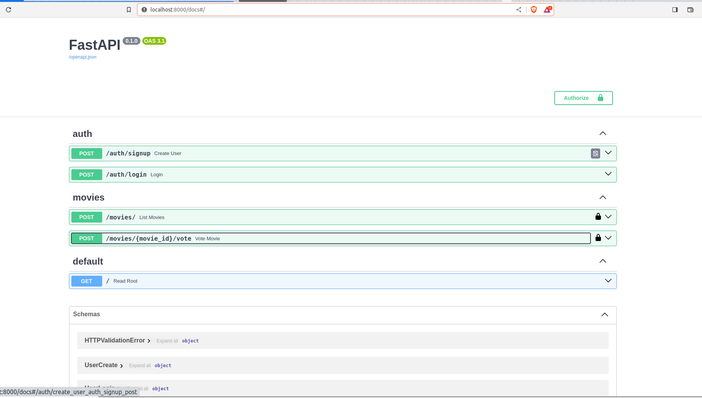

# Stremio


## WORKBOUNCE TAKE HOME TEST
The purpose of this project is to develop a web API that allows users to retrieve a list of movies, rate them by upvoting or downvoting, and view their own rated movies. The application will require authentication to ensure user privacy and security. The project aims to provide an enjoyable and personalized movie rating experience for users.

## Implementation Details

- Implement user authentication to ensure secure access to the application.
- Enable users to view a list of movies from a datastore and the ability to paginate.
- Allow users to rate movies using upvotes and downvotes.
- Enable users to view a personalized list of rated movies.
- Ensure efficient and seamless retrieval from third party API by using CACHE to store the movie data for 24 hours.
- Implement Retry mechanism to handle errors gracefully and report failed requests.
- Implement a logging mechanism to log errors and user activities.


## Features


## Technologies

- Python 3.8 or later
- FastAPI
- Uvicorn
- Pytest
- sqlmodel
- sqlite3

## Getting Started


### Running Locally

1. Clone the repository to your local machine:

   ```bash
   git clone https://github.com/koiic/stremio.git
   cd stremio
   create a virtual environment and activate it
   example: python3 -m venv venv or virtualenv venv
    source venv/bin/activate . (linux)
    venv\Scripts\activate (windows)
   pip install -r requirements.txt
   
   create a .env file from the .env.example file and update the values
    ```

   
Run the application:

   ```bash
   cd backend
   run make run_api
   or
   uvicorn main:app --reload
    ```

    For example: using the already added txt file

    ```bash
   
    ```
   you will see the logs in the terminal and you can test by visiting localhost:8000/docs.
   ```
  Optional - Run the tests:

   ```bash
   pytest
   ```
   
### Sample Documentation Image

